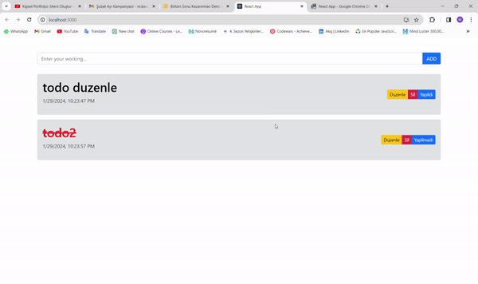

# TODOGIF

* In this project, I utilized Axios to perform todo operations. I created a database by creating a db.json file and used Axios's PUT, POST, GET, and DELETE methods to make updates in my todo project. Meanwhile, I decided when to fetch my data using the useEffect hook. By employing the mentioned methods, I updated the data both on the client side and in the database.

